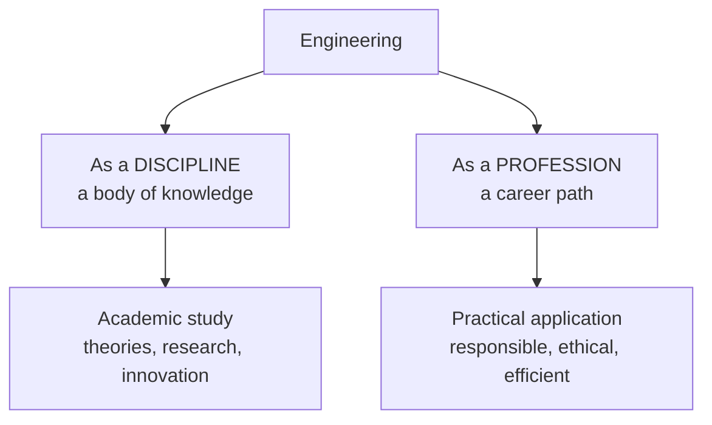

# Engineering as a Discipline and a Profession

> **Source:** `Module 1/Engineering as Discipline Profession.pdf` (Lecture 01), pages 1–20 · **Syllabus:** Engineering and Engineer

## Key points

- **Engineering** combines physics, mathematics and material science with innovation, analysis and design to build technologies that meet human needs **safely, efficiently and sustainably**.
- The same field is viewed two ways: as a **discipline** (a body of knowledge) and as a **profession** (a career path).
- The **discipline** generates knowledge; the **profession** applies it. Discipline lives in universities and research labs; profession lives in industry, government and consultancy.
- Six components define the discipline: scientific foundation, mathematical modelling, design thinking, technical knowledge, experimentation and analysis, innovation and research.
- Six elements define the profession: application of knowledge, professional responsibility, ethics and integrity, licence and certification, teamwork and communication, lifelong learning.

---

## 1. Definition

> Engineering is a professional discipline that combines knowledge from **physics, mathematics, and material science** with **innovation, analysis, and design** to develop technologies and solutions that meet human needs in a **safe, efficient, and sustainable** way.

The subject is therefore approached from two directions:

## 2. Engineering as a discipline

Engineering as a discipline is a **branch of academic study and systematic knowledge** that applies scientific and mathematical principles to solve real-world problems. It involves learning theories, developing technologies, designing systems and innovating solutions to improve life, with a focus on **problem-solving and innovation**.

**Key branches:** Mechanical, Electrical, Civil, Chemical, Computer, etc.

### Characteristics

- Interdisciplinary nature.
- Strong foundation in mathematics and science.
- Involves design, analysis, experimentation.
- Emphasis on continual improvement and lifelong learning.

### Key components

| # | Component | What it means |
|---|---|---|
| 1 | **Scientific foundation** | Engineers must understand the laws of nature — how forces act, how energy flows, how materials behave. This knowledge comes from physics, chemistry and biology. |
| 2 | **Mathematical modelling** | Mathematics is the language of engineering. Engineers use equations and formulas to model systems, predict outcomes and optimize performance. |
| 3 | **Design thinking** | Students are trained to think creatively and logically: define a problem, brainstorm solutions, model and simulate designs, and improve systems through iteration. |
| 4 | **Technical knowledge** | Each branch — mechanical, electrical, civil, electronics, chemical, computer — has its own technical core that students specialize in. |
| 5 | **Experimentation and analysis** | Labs and experiments validate theories. Engineers collect data, analyze results, and understand how things work in real-world scenarios. |
| 6 | **Innovation and research** | Developing new materials, creating energy-efficient systems, improving manufacturing processes, and advancing technology through research. |

### In an academic context

- A **mechanical engineering** student learns thermodynamics, machine design and manufacturing processes.
- An **electrical engineering** student studies circuit theory, electromagnetism and signal processing.
- A **computer science** student explores algorithms, programming languages, artificial intelligence and data structures.

## 3. Engineering as a profession

Engineering as a profession goes beyond classroom learning — it is the **practical application of engineering knowledge to design, develop, operate and maintain** systems, products and processes that serve the needs of society. A professional engineer takes on real-world challenges and solves them **responsibly, ethically and efficiently**.

It is **licensed and regulated by professional bodies** (e.g. IEEE, ASCE, NEC), and career-oriented: roles in industry, government and consultancy.

### Key elements

**1. Application of knowledge**
Engineers use theories and principles from their academic training to solve problems in construction, manufacturing, energy, healthcare, information technology and transportation.
*Example:* a mechanical engineer designs an energy-efficient HVAC system for a hospital using thermodynamics and fluid-flow principles.

**2. Professional responsibility**
Engineering is not just about solving technical problems; it involves decisions that affect **people, property and the environment**. Engineers are trusted to act in the public interest.
*Example:* a structural engineer must ensure a building is safe, sustainable and compliant with regulations — lives may depend on it.

**3. Ethics and integrity**
Professional engineers follow a **code of ethics**: honesty, accountability, fairness and respect for others. They must avoid conflicts of interest, ensure transparency, and always **prioritize safety over profits**.
*Example:* an engineer must refuse to certify a faulty design, even under pressure from management, if it compromises safety.

**4. Licence and certification**
In many countries engineers must obtain a professional licence (e.g. **PE — Professional Engineer**) to legally practise and sign off on projects. This ensures they have the competence and experience needed for critical work.

| Country | Requirement |
|---|---|
| **India** | An engineer working on a government infrastructure project — such as the design and approval of a national highway — must often be a **Chartered Engineer (CE)** registered with the **Institution of Engineers (India) [IEI]**. This certification validates professional competence and allows them to sign technical documents, drawings and certifications required by agencies and regulatory bodies such as **CPWD, Indian Railways or NHAI**. |
| **United States** | A civil engineer must obtain a **Professional Engineer (PE)** licence to approve structural designs for public infrastructure such as bridges or highways. Without it they are not legally allowed to sign off on critical design documents submitted to government authorities for construction approval. |

**5. Teamwork and communication**
Engineers work in **multidisciplinary teams**, collaborating with architects, doctors, software developers, government bodies and clients.
*Example:* a biomedical engineer works with surgeons to design a custom knee implant and explains the design choices in clear, simple terms.

**6. Lifelong learning and innovation**
Technology and industry needs constantly evolve; a professional engineer must continuously upgrade skills and learn new tools, software, materials and methods.
*Example:* an electrical engineer learns about AI and IoT to implement smart energy grids in urban planning.

### Real-world examples

- A **civil engineer** oversees the construction of a flyover, ensuring it is strong enough to handle traffic loads and seismic forces.
- A **software engineer** develops secure banking applications used by millions of people.
- A **chemical engineer** in a pharmaceutical plant ensures medicines are produced under safe and controlled conditions.
- A **renewable energy engineer** designs and installs solar power systems to promote sustainability.

## 4. Discipline vs. profession — comparison

| Aspect | Engineering as a discipline | Engineering as a profession |
|---|---|---|
| **Focus and practice** | Generation of knowledge, theories, innovation and research | Practical application of knowledge to solve real-world problems |
| **Setting** | Academic institutions, research labs, universities | Industries, corporate sectors, consultancy, government agencies |
| **Output** | Scientific theories, experimental results, conceptual designs | Functional products, infrastructure, processes, services |
| **Goal** | Advance the frontiers of science and technology | Ensure safety, efficiency and service to society |

## 5. Conclusion

- Engineering **bridges theory and practice**.
- It is a **discipline grounded in science** and a **profession rooted in service**.
- Engineers shape the future through **responsible innovation**.

> How that responsibility translates into day-to-day capability and duty is covered in [Attributes and Functions of a Practicing Engineer](02-attributes-and-functions-of-a-practicing-engineer.md).
