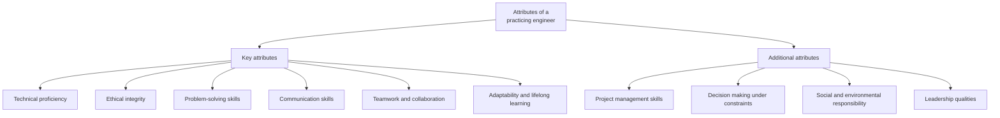
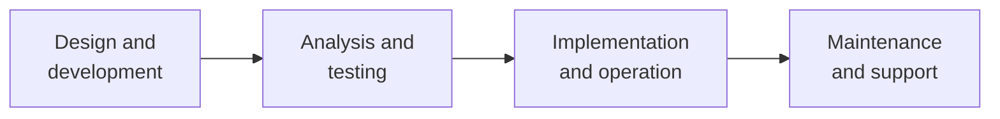

# Attributes and Functions of a Practicing Engineer

> **Source:** `Module 1/Lecture 2 Practicing Engineer.pdf` (Lecture 02), pages 1–7 · **Syllabus:** Engineering and Engineer

## Key points

- A **practicing engineer** applies engineering principles to real-world problems and is actively involved in the profession — either as a licensed **Professional Engineer (PE)**, or as someone gaining experience under a PE's supervision.
- Scope of the role: **from concept to reality** — transforming ideas into practical solutions.
- Ten attributes divide into six **key** and four **additional** ones; the four **core functions** are design and development, analysis and testing, implementation and operation, and maintenance and support.

---

## 1. Who is a practicing engineer?

- A practicing engineer is someone who **applies engineering principles to solve real-world problems** and is **actively involved in the engineering profession**.
- A practicing engineer can be a **Professional Engineer (PE)**, licensed to offer engineering services to the public, **or** someone who is **gaining experience under the supervision of a PE**.

The lecture frames the role by its importance in modern society and by its scope: **from concept to reality — transforming ideas into practical solutions.**

> The licence itself, and the bodies that issue it, are covered in [Engineering as a Discipline and a Profession](01-engineering-as-a-discipline-and-a-profession.md#3-engineering-as-a-profession).

## 2. Attributes

### Key attributes

| Attribute | Meaning |
|---|---|
| **Technical proficiency** | Mastery in core engineering principles |
| **Ethical integrity** | Adheres to codes of ethics and professional conduct |
| **Problem-solving skills** | Analytical and innovative mindset |
| **Communication skills** | Effective oral and written communication |
| **Teamwork and collaboration** | Works well in multidisciplinary teams |
| **Adaptability and lifelong learning** | Stays updated with technological advancements |

### Additional attributes

| Attribute | Meaning |
|---|---|
| **Project management skills** | Planning, executing and leading projects |
| **Decision making under constraints** | Balancing cost, time, quality and safety |
| **Social and environmental responsibility** | Understanding sustainability and societal impact |
| **Leadership qualities** | Influencing, guiding and mentoring others |

## 3. Core functions

| Function | What it covers |
|---|---|
| **Design and development** | Creating products, processes or systems |
| **Analysis and testing** | Evaluating performance and ensuring quality |
| **Implementation and operation** | Overseeing production and daily functions |
| **Maintenance and support** | Ensuring long-term functionality |

These four functions run in sequence over the life of a system, and each maps onto later topics in the course:

> Two of these attributes are expanded into full topics in Module 2: **project management skills** in [Project Management](../module-2/07-project-management.md), and **decision making under constraints** in [Problem Complexity, Uncertainty, Risk and Ambiguity](../module-2/06-problem-complexity-uncertainty-risk-and-ambiguity.md). The three roles the engineer plays while carrying out these functions are covered in [Engineer as Problem Solver, Designer and Change Agent](03-engineer-as-problem-solver-designer-and-change-agent.md).
