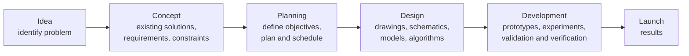

# Engineer as Problem Solver, Designer and Change Agent

> **Source:** `Module 1/Lecture 2 Practicing Engineer.pdf` (Lecture 02), pages 8–13 · **Syllabus:** Engineering and Engineer

## Key points

- As a **problem solver**, the engineer follows the **Engineering Method** — a six-phase route from idea to launch that runs parallel to the six steps of the **Scientific Method**.
- As a **designer**, the engineer follows the **engineering design process**: determining objectives and constraints, prototyping, testing and evaluation.
- As a **change agent**, the engineer identifies areas for improvement, initiates innovation, implements new solutions, and influences others toward positive transformation — across six key aspects.

---

## 1. Engineer as a problem solver

> Slide 8 of the source deck presents this as an image. The table below is **transcribed directly from that slide image**.

The deck sets the **Engineering Method** (six phases) alongside the **Scientific Method** (six steps):

| | Phase 1 | Phase 2 | Phase 3 | Phase 4 | Phase 5 | Phase 6 |
|---|---|---|---|---|---|---|
| **Engineering Method** | Idea | Concept | Planning | Design | Development | Launch |
| **Activities** | Identify problem | Existing solutions; requirements; constraints | Define objectives; plan program and schedule | Drawings; schematics; models; algorithms; proof of concept | Prototypes; experiments; validation and verification | Results |
| **Scientific Method** | Step 1 — Ask a question | Step 2 — Do background research | Step 3 — Construct a hypothesis | Step 4 — Test hypothesis | Step 5 — Analyze data and draw conclusion | Step 6 — Communicate |

## 2. Engineer as a designer

> The **engineering design process** is a series of steps that engineers follow to find a solution to a problem. The steps include problem-solving processes such as **determining your objectives and constraints, prototyping, testing and evaluation**.

## 3. Engineer as a change agent

A **change agent** is someone who:

- Identifies areas for improvement
- Initiates innovation
- Implements new solutions
- Influences others toward positive transformation

### Key aspects

| # | Aspect | What engineers do | Example |
|---|---|---|---|
| 1 | **Technological transformation** | Introduce new technologies (AI, renewable energy, electric vehicles). | Electrical engineers helped shift from fossil fuels to solar and wind power, transforming the energy sector. |
| 2 | **Solving societal challenges** | Design systems to solve global issues such as clean water, climate change and healthcare access. | Engineers Without Borders works to design low-cost water purification systems in rural areas. |
| 3 | **Sustainable development** | Promote eco-friendly designs and sustainable practices. | Green buildings, biodegradable materials, energy-efficient transport systems. |
| 4 | **Economic growth** | Developing efficient products and systems boosts productivity and economic development. | Automation in manufacturing has revolutionized global supply chains. |
| 5 | **Digital innovation** | Central to the digital revolution, creating smart systems and AI-based solutions. | Software engineers developing health apps that monitor and predict disease. |
| 6 | **Disaster management and recovery** | Design systems for early warning, rescue operations and rebuilding. | Structural engineers redesign buildings to be earthquake-resistant. |

> Aspects 3 and 4 return in Module 2 as measurable engineering functions — sustainability and efficiency under [Productivity](../module-2/04-productivity.md), and the economics of engineering decisions under [Costing and Accounting](../module-2/09-costing-and-accounting.md).
