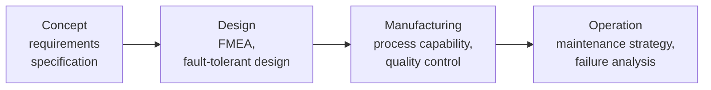

# Design for Reliability

> **Source:** `Module 2/Design for Reliability.pdf` (Lecture 04), pages 1–14 · `Module 2/Lecture Notes Module II EPP.pdf`, pages 2–5 · **Syllabus:** Selected Functions of Engineering

## Key points

- **Reliability** = the **probability** that a product or system performs its intended function **without failure for a specified period under stated conditions**.
- Quality is judged **at the time of purchase**; reliability is judged **over time**.
- **Reliability is designed, not tested in** — the design phase decides it; testing only confirms it.
- Six design techniques: redundancy, derating, environmental protection, stress–strength analysis, modular design, robust design (Taguchi methods).
- Core metrics: **MTTF** (non-repairable), **MTBF** (repairable), failure rate **λ**, reliability function **R(t)**, **MTTR**, availability.

---

## 1. What is reliability?

> **Reliability** is the probability that a product, system or service will **perform its intended function adequately for a specified period of time**, or will **operate in a defined environment without failure**.

**Focus:** long-term performance and **failure prevention**.

## 2. Why design for reliability?

- Enhances **customer satisfaction**
- Reduces **warranty costs**
- Improves **brand reputation**
- Reduces **total lifecycle cost**
- Ensures **safety and compliance**

## 3. Quality vs. reliability

The difference between quality and reliability lies in **how a product performs initially versus how it continues to perform over time**.

| Aspect | Quality | Reliability |
|---|---|---|
| **Timeframe** | At the time of purchase/use | Over a period of time |
| **Measure** | Meets specifications and expectations | Performs consistently without failure |
| **Example** | A sharp, new LED TV with vibrant colors | A washing machine that works well for 10 years |
| **Focus** | Initial features and performance | Long-term dependability |

> Reliability is *also* one of Garvin's eight dimensions of product quality — see [Quality Management](03-quality-management.md#4-garvins-eight-dimensions-of-product-quality). The two concepts overlap; the table above separates them.

## 4. Reliability across the product life cycle

| Phase | Reliability work |
|---|---|
| **Concept** | Requirements specification |
| **Design** | FMEA, fault-tolerant design |
| **Manufacturing** | Process capability, quality control |
| **Operation** | Maintenance strategy, failure analysis |

> **FMEA** is developed in full in [Design for Safety](01-design-for-safety.md#5-safety-analysis-tools).

## 5. Design techniques and strategies

### Design techniques for reliability

| Technique | What it does |
|---|---|
| **Redundancy** | Duplicate components or systems — e.g. dual engines in aircraft. |
| **Derating** | Operating components below their rated stress limits. |
| **Environmental protection** | Shielding the system from its operating environment. |
| **Stress–strength analysis** | Comparing applied stress against material/component strength. |
| **Modular design** | Building the system from replaceable, independently testable modules. |
| **Robust design (Taguchi methods)** | Minimizing the effect of variations — e.g. voltage fluctuations. |

### Additional reliability strategies

- **Predictive maintenance** — designing systems to **monitor wear and signal when servicing is due**.
- **Statistical reliability testing** — using metrics such as **MTBF**, **MTTR** and overall **system availability**.

## 6. Key reliability metrics

| Metric | Meaning |
|---|---|
| **MTTF** | **Mean Time To Failure** — for **non-repairable** items |
| **MTBF** | **Mean Time Between Failures** — for **repairable** items; a key reliability metric used to **predict the average time between system failures** |
| **MTTR** | **Mean Time To Repair** |
| **λ** | **Failure rate** |
| **R(t)** | **Reliability function** |

## 7. Testing for reliability

| Test | Full name |
|---|---|
| **ALT** | Accelerated Life Testing |
| **HALT** | Highly Accelerated Life Testing |
| **Burn-in testing** | — |
| **ESS** | Environmental Stress Screening |

## 8. Examples

### Reliable web server system

A team has developed a web server for an e-commerce website.

| ✅ High reliability | ❌ Low reliability |
|---|---|
| The server runs **24/7 without crashing** | The server **crashes frequently**, requiring restarts |
| It handles **high user traffic** during sales events | It **lags or becomes unresponsive** under moderate load |
| It **recovers quickly from minor failures** (redundancy or failover) | Users **lose data** during transactions |
| It operates for **months or years** without unexpected downtime | It needs **frequent maintenance or patching** to function |

### Automotive Electronic Control Unit (ECU) design

- High vibration environment
- **Conformal coating** for moisture resistance
- **Redundant power supplies** for fail-safe operation
- **MTBF target: 100,000 hours**
- **FMEA** revealed **thermal stress** as the major issue → improved heat sinks

### Case study — smartphone battery reliability

| | |
|---|---|
| **Problem** | Frequent customer complaints of overheating |
| **Root cause** | Charging circuit component failure |
| **Solution** | Improved thermal pad placement + component **derating** |
| **Outcome** | **MTBF improved by 45%** |

## 9. Summary

- **Reliability is designed, not tested in.**
- Tools such as **FMEA** and **FTA** help identify and mitigate failure risks.
- **Robust design** ensures long-term performance and customer trust.

> Safety and reliability are complementary: a system that works perfectly but is prone to unsafe failure is unacceptable, and one that is safe but unreliable becomes costly and inefficient. Hence a well-rounded design must **integrate both** — see [Design for Safety § Integrating safety and reliability](01-design-for-safety.md#8-integrating-safety-and-reliability-into-design).
