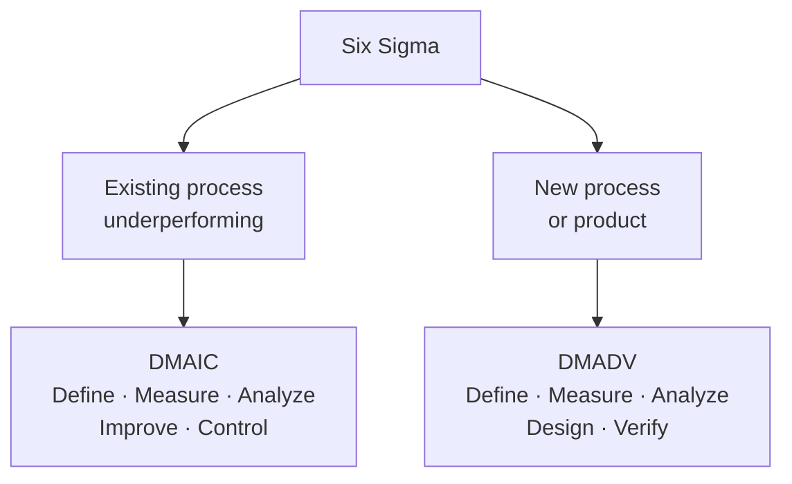

# Quality Management

> **Source:** `Module 2/Quality Lecture 05.pdf` (Lecture 05), pages 1–21 · `Module 2/Lecture Notes Module II EPP.pdf`, pages 6–7 · **Syllabus:** Selected Functions of Engineering

## Key points

- **Quality** is the ability of a product, process or service to consistently **meet or exceed customer requirements and expectations**.
- Crosby: *conformance to requirements*. Juran: *fitness for use*. Garvin: five **categories** of definition (transcendent, product-based, manufacturing-based, user-based, value-based).
- Garvin also gives the **eight dimensions of product quality**.
- **QC** finds defects after the fact; **QA** prevents them by improving the process.
- **TQM** is organization-wide and cultural; **Six Sigma** is data-driven and statistical, targeting **3.4 defects per million opportunities**.
- **DMAIC** improves existing processes; **DMADV** designs new ones.

---

## 1. What is quality?

**Quality** can be defined as the ability of a product, process or service to **consistently meet or exceed customer requirements and expectations**. In engineering, quality is multifaceted and includes **durability, performance, reliability, safety and aesthetic value**.

## 2. Classical definitions

| Author | Definition |
|---|---|
| **Crosby** | Quality is **conformance to requirements or specifications**. |
| **Juran** | Quality is **"fitness for use"**. |
| **Garvin** | Quality has **five categories of definition** — see below. |

## 3. Garvin's five categories of definition

| Category | Definition | In one line |
|---|---|---|
| **Transcendent** | Quality cannot be defined — you know what it is. | *It is not clear what it is, but it is something good.* |
| **Product-based** | Differences in quality amount to differences in the quantity of some desired ingredient or attribute. | *The product has something that adds value that other similar products do not.* |
| **Manufacturing-based** | Quality means conformance to requirements; the degree to which a specific product conforms to a design or specification. | *Conforming to design, specifications or requirements. Having no defects.* |
| **User-based** | Quality consists of the capacity to satisfy wants — the degree to which a specific product satisfies the wants of a specific consumer. In the final analysis of the marketplace, the quality of a product depends on how well it fits patterns of consumer preferences. Quality is fitness for use. | *Fitness for use, meeting customer expectations.* |
| **Value-based** | Quality is the degree of excellence at an acceptable price, and the control of variability at an acceptable cost. Quality means best for certain customer conditions — namely (a) the actual use and (b) the selling price of the product. | *The product is the best combination of price and features.* |

## 4. Garvin's eight dimensions of product quality

| # | Dimension | Definition | Example |
|---|---|---|---|
| 1 | **Performance** | The primary operating characteristics of a product. | A car's acceleration, fuel efficiency, or top speed. |
| 2 | **Features** | Additional characteristics or secondary functions that enhance appeal or usability. | Bluetooth, GPS or heated seats in a car. |
| 3 | **Reliability** | The likelihood that a product will function without failure for a given period. | A computer that runs smoothly without crashing for years. |
| 4 | **Conformance** | The degree to which the product meets design and operating specifications. | Manufactured gears having exact tolerances as per the design. |
| 5 | **Durability** | The amount of use a product can sustain before it deteriorates or fails. | The lifespan of a smartphone battery or an aircraft engine. |
| 6 | **Serviceability** | How easy it is to maintain, repair or upgrade the product. | A modular laptop where parts can be easily replaced. |
| 7 | **Aesthetics** | The look, feel, sound, taste or smell of the product — subjective to users. | The sleek design and feel of a premium smartphone. |
| 8 | **Perceived quality** | The customer's perception of quality based on brand image, reputation or prior experience. | Apple products are often seen as high-quality due to branding and past performance. |

> Dimension 3, **reliability**, is a full topic in its own right — see [Design for Reliability](02-design-for-reliability.md).

## 5. Quality control vs. quality assurance

| | **Quality Control (QC)** | **Quality Assurance (QA)** |
|---|---|---|
| **What it does** | Identifies defects through **inspection and testing** during or after production | Focuses on **preventing defects** by improving processes from the outset |
| **Stance** | Reactive — finds problems | Proactive — stops problems arising |

## 6. Quality Management Systems (QMS)

Most organizations adopt a **Quality Management System** to standardize practices and ensure compliance. The **ISO 9001** standard is the **most widely recognized QMS framework globally**.

## 7. Total Quality Management (TQM)

**TQM** is a **holistic approach** in which **all members of an organization** participate in improving processes, products, services and culture.

**Core principles:**

- Customer-focused
- Continuous improvement (**Kaizen**)
- Employee involvement
- Process-oriented thinking
- Fact-based decision making
- Integrated system

TQM shifts the focus from **merely inspecting finished goods** to **improving the entire value creation process**.

## 8. Six Sigma

Initiated by **Motorola in 1987**, Six Sigma is a business strategy for **process improvement and corporate growth** (Antony 2004) that provides a disciplined and structured approach, using both **statistical and non-statistical tools and techniques** within its improvement and design methodologies.

It is a **data-driven methodology** aimed at improving business processes by **eliminating defects and minimizing variability**, widely used in manufacturing, service industries, healthcare and other sectors. Six Sigma aims for near perfection — **only 3.4 defects per million opportunities**.

### Key objectives

- Reduce defects (errors or inconsistencies)
- Improve process capability and performance
- Enhance customer satisfaction
- Lower operational costs

### Core principles

| Principle | Description |
|---|---|
| **Customer focus** | Delivering what the customer values most. |
| **Data-driven decision making** | Using statistical tools and data analysis for decisions. |
| **Process focus** | Improving and controlling business processes. |
| **Proactive management** | Preventing issues instead of reacting to them. |
| **Collaboration** | Teamwork and cross-functional engagement. |
| **Continuous improvement** | Ongoing effort to improve performance. |

### DMAIC — for improving existing processes

| Step | Description |
|---|---|
| **D — Define** | Identify the problem, goals and customer requirements. |
| **M — Measure** | Collect data to understand current performance. |
| **A — Analyze** | Identify root causes of defects or variations. |
| **I — Improve** | Implement and test solutions to eliminate root causes. |
| **C — Control** | Monitor the improved process to sustain gains. |

### DMADV — for creating new processes or products

| Step | Description |
|---|---|
| **D — Define** | Project goals and customer needs. |
| **M — Measure** | Determine customer needs and specifications. |
| **A — Analyze** | Design alternatives and evaluate options. |
| **D — Design** | Develop detailed design and verify. |
| **V — Verify** | Validate design through pilot testing and feedback. |

### Key Six Sigma tools

A large number of Six Sigma tools are in use. The popular ones are:

- Quality Function Deployment
- Process Map
- Seven Basic Tools of Quality
- Measurement System Analysis
- Multi-vari Study
- Capability Study
- Control Charts
- Failure Mode and Effects Analysis
- Design of Experiments
- Control Plan

> These tools, along with the **seven basic quality tools** and the wider productivity toolkit, are catalogued in [Quality and Productivity Tools](05-quality-and-productivity-tools.md). **FMEA** is developed in [Design for Safety](01-design-for-safety.md#5-safety-analysis-tools).

## 9. Quality and productivity together

Quality ensures that the product or service is **fit for use**, while productivity ensures that it is **delivered efficiently**, using the least possible resources without compromising standards. A systematic approach to managing both leads to **organizational excellence and long-term sustainability**.

> Continued in [Productivity](04-productivity.md).
