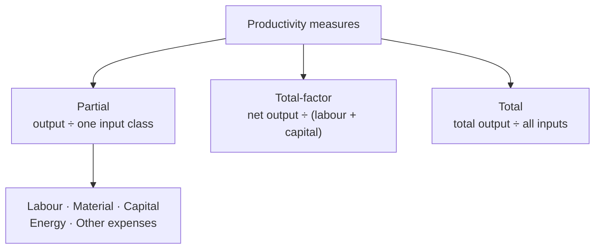

# Productivity

> **Source:** `Module 2/Productivity Lecture 06.pdf` (Lecture 06), pages 1–13 · `Module 2/Lecture Notes Module II EPP.pdf`, pages 8–9 · **Syllabus:** Selected Functions of Engineering

## Key points

- **Production** is *how much* was made; **productivity** is *how efficiently* it was made — output ÷ input.
- **Efficiency** = actual output ÷ standard output (how well inputs are used). **Effectiveness** = degree of accomplishment of objectives (how well outputs meet their goals). A process can be efficient and still ineffective.
- Three levels of measure: **partial** (one input class), **total-factor** (net output ÷ labour + capital), **total** (all output ÷ all inputs).
- Monetary values must be **deflated to a base year** by their price index before productivity can be compared across years.
- Raising one partial productivity can **lower** another — always check the combined figure.
- **Services** rarely admit "one unit of service", so service productivity is measured as **revenue ÷ cost**.

---

## 1. Production vs. productivity

| | **Production** | **Productivity** |
|---|---|---|
| **Concerned with** | The activity of **producing** goods and/or services | The **efficient utilization of resources** (inputs) producing goods and/or services (output) |
| **In quantitative terms** | The **quantity of output** produced | The **ratio of the output produced to the input(s) used** |

$$\text{Productivity} = \frac{\text{Output produced}}{\text{Input(s) used}}$$

### Worked example

> A company manufacturing electronic calculators produced **10,000 calculators** employing **50 persons** working at **8 hours/day for 25 days**. What are the values of production and productivity during this period?

- **Production** = 10,000 calculators
- **Productivity** = 10,000 ÷ (50 × 25 × 8) = **1 calculator/person-hour**

> Check that if the company used **10 additional persons** and produced **20% more** calculators, **production went up, but not productivity**.

## 2. Efficiency vs. effectiveness

| | **Efficiency** | **Effectiveness** |
|---|---|---|
| **Definition** | The ratio of **actual output achieved** to **standard output expected** | The **degree of accomplishment of objectives** |
| **Concerned with** | How well the **inputs** are utilized | How well the **outputs accomplish their intended goals** |

### Worked example

> An operator produced **120 pieces per hour**, the standard rate being **180 pieces per hour**. What is the operator efficiency?

$$\text{Operator efficiency} = \frac{120}{180} = 66.67\%$$

> Suppose that **60%** of the produced pieces fail to accomplish their intended functions and could not be sold, and **20%** of the sold pieces malfunctioned within one month of sale. The customer satisfaction and quality image of the company fell by **50%**.

The operation has a **low effectiveness**. Both **qualitative and quantitative** measures are used to signify effectiveness.

## 3. Partial, total-factor and total productivity

| Measure | Definition |
|---|---|
| **Partial productivity** | The ratio of output to **one class of inputs** — e.g. labour productivity, material productivity, capital productivity. |
| **Total-factor productivity (TFP)** | The ratio of **net output** to the sum of the associated **labour and capital** inputs, where **net output = total output − intermediate goods and services purchased**. |
| **Total productivity** | The ratio of **total output** to the sum of **all** inputs. |

> The lecture notes give the same partial measures under the names **labour productivity, capital productivity, material productivity**, with **TFP** as the comprehensive measure.

## 4. Real (monetary) values of goods and services

When inputs and outputs are measured in **monetary units**, these values must be **deflated to the base year** by dividing them by the **price index** figures, to find their **real monetary values**.

### Worked example — deflating to a base year

> A company bought **10 pieces of MS plate in 2022** for **Rs 121,000**, used **5** of these pieces **in 2024** to produce goods, some of which were sold in the same year for **Rs 100,000** and the remaining goods for **Rs 100,000 in the next year**. Labour cost to produce these goods was **Rs 20,000**. Energy and other costs apportioned to the produced goods equal **Rs 12,000**. Find the productivity.
> **2020 is the base year.** Price index figures for the next 5 years are **105, 110, 115, 120, 125**.

| Item | Calculation | Real value |
|---|---|---|
| Real cost of materials used (incurred 2022) | 121,000 × (5/10) × (100/110) | **Rs 55,000** |
| Real cost of labour, energy and other costs (incurred 2024) | 32,000 × (100/120) | **Rs 26,667** |
| Sales revenue (realized 2024 and 2025) | 100,000 × (100/120) + 100,000 × (100/125) | **Rs 163,667** |

$$\text{Productivity} = \frac{163{,}667}{55{,}000 + 26{,}667} = 2.004$$

> This figure should be **compared with the productivity figure in the base year**.

> **⚠ Note on the sales-revenue line.** The deck's own expression evaluates to **163,333**, not the **163,667** it prints — 100,000 × (100/120) = 83,333 and 100,000 × (100/125) = 80,000. Both the expression and the printed answer are reproduced above as the deck has them. With 163,333 the productivity works out to exactly **2.000** (163,333 ÷ 81,667), which is almost certainly the intended figure; **2.004** is what the deck's own numbers give. The method — deflate each amount by the price index of the year it was incurred or realized — is unaffected either way.

### Worked example — all measures from one set of real values

> Consider the following real monetary values w.r.t. a base year for a company:
> **Output = Rs 1000. Labour input = Rs 300. Material input = Rs 200. Capital input = Rs 300. Energy input = Rs 100. Other expense input = Rs 50.**

| Measure | Calculation | Result |
|---|---|---|
| **Labour productivity** | 1000 / 300 | 3.33 |
| **Material productivity** | 1000 / 200 | 5.00 |
| **Capital productivity** | 1000 / 300 | 3.33 |
| **Energy productivity** | 1000 / 100 | 10.00 |
| **Other expenses productivity** | 1000 / 50 | 20.00 |
| **Total-factor productivity** | (1000 − (200 + 300 + 100 + 50)) / (300 + 300) | 0.583 |
| **Total productivity** | — see note below — | 1.053 |

The TFP line carries the assumption: *material and other services are bought, and machines are on lease.*

> **⚠ Note on the total productivity line.** The slide prints the expression as `(1000 − (300+200+300+100+50)) / (300+300)`, but that evaluates to **0.083**, not the stated **1.053**. The stated answer **1.053 = 1000 / 950**, which is the deck's own definition of total productivity — *total output ÷ the sum of all inputs* — with all five inputs summing to 950. Expect **1.053** as the intended answer.

## 5. Trade-offs between partial productivities

> A machine produces **100 parts per hour** with one operator. This machine is replaced by another with which the operator produces **120 parts**.
> Past and new **labour productivity** = 100 and 120 parts/person-hour — a rise of **20%**.
> Operating costs of old and new machines are **Rs 40** and **Rs 60** per person-hour, and the wage rate is **Rs 5**/person-hour.

| Measure | Old | New | Productivity index |
|---|---|---|---|
| **Labour productivity** | 100/5 = **20** parts/rupee | 120/5 = **24** parts/rupee | 24/20 = **1.2** |
| **Machine productivity** | 100/40 = **2.5** parts/rupee | 120/60 = **2** parts/rupee | 2/2.5 = **0.8** |
| **Combined labour & machine** | 100/45 = **2.22** parts/rupee | 120/65 = **1.85** parts/rupee | 1.85/2.22 = **0.83** |

**Reading:** labour productivity rose 20%, but machine productivity fell 20% and the **combined** figure fell 17%. A gain in one partial measure does not imply a gain overall.

## 6. Productivity of a multi-product company

Suppose a company produces **n** products, and the output, labour, material, energy, capital and other expenses are known for each product *i* = 1, …, *n*. Then one can compute:

- Productivities **at each product level**, and
- **Total productivity at the company level** = Sum of all outputs ÷ Sum of all inputs

## 7. Service productivity

- It is **seldom possible to define "one unit of a service."**
- Productivity measurements in services are normally only **partial measurements**:
  - How many customers are served by a restaurant waiter in a day
  - How many phone calls are dispatched by a call-centre employee
- **Reducing input improves input efficiency, but can reduce quality, hence output, and hence productivity.**
- Banks offer **ATM services** and insurance companies offer **call-centre services**. Quality of service has not deteriorated — hence these are **effective schemes**.

$$\text{Service productivity} = \frac{\text{Revenue from a service}}{\text{Cost of producing the service}}$$

For the **global productivity of operations** of a service provider:

$$\text{Service productivity} = \frac{\text{Total revenue}}{\text{Total cost}}$$

## 8. Productivity improvement techniques

| # | Technique | What it does |
|---|---|---|
| 1 | **Lean manufacturing** | Minimizes waste (*muda*) while maximizing value. **7 wastes to eliminate:** overproduction, waiting, transport, extra processing, inventory, motion, defects. Uses tools such as **5S, value stream mapping and Kanban**. |
| 2 | **Just-In-Time (JIT)** | Reduces inventory costs by receiving goods **only as they are needed** in the production process. |
| 3 | **Time and motion study** | Analyzes work processes to **remove inefficiencies and standardize tasks**. |
| 4 | **Work study** | Combines **method study** (how tasks are done) and **work measurement** (time required) to optimize workflows. |
| 5 | **Automation and digital tools** | Robotics, AI, CNC machines and IoT reduce manual labour and increase precision. |

> **5S**, **value stream mapping** and the rest of the toolkit are detailed in [Quality and Productivity Tools](05-quality-and-productivity-tools.md).

## 9. Quality and productivity integration

The two domains are interlinked:

- **High quality** leads to fewer defects → less rework → **increased productivity**.
- **Efficient processes** reduce costs → allow resources to be focused on **quality improvements**.

*Example:* a company with efficient manufacturing practices (high productivity) can invest more in quality checks and R&D, leading to better product quality.

> For quality itself — its definitions, dimensions, TQM and Six Sigma — see [Quality Management](03-quality-management.md).
