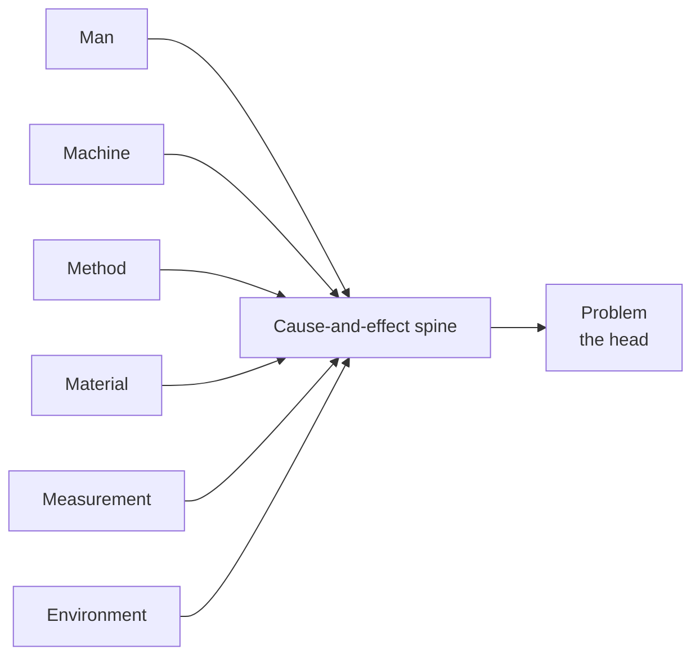

# Quality and Productivity Tools

> **Source:** `Module 2/Lecture Notes Module II EPP.pdf`, pages 10–15 · `Module 2/Quality Lecture 05.pdf` (Lecture 05), page 21 · **Syllabus:** Selected Functions of Engineering

## Key points

- Engineers rely on a toolkit drawn from **industrial engineering, quality control, statistical analysis and management sciences**, used across manufacturing, service and design sectors.
- The **seven basic quality tools** are the classical core; the wider catalogue adds workplace, lean and improvement tools.
- **Choosing the right tool depends on the problem at hand, the nature of the process, and the goals of the organization.**
- Implementation usually fails for **human** reasons — resistance to change, weak management commitment, poor training, short-termism — not technical ones.

---

## 1. The seven basic quality tools

> Listed in `Quality Lecture 05.pdf` as one of the popular Six Sigma tool sets.

| # | Tool | Purpose |
|---|---|---|
| 1 | **Cause-and-Effect Diagram** (Ishikawa or Fishbone Diagram) | Identifies root causes of a problem. |
| 2 | **Check Sheet** | Collects and organizes data in real time. |
| 3 | **Control Chart** | Monitors process variation over time. |
| 4 | **Histogram** | Shows frequency distribution of data. |
| 5 | **Pareto Chart** | Identifies and prioritizes major causes (80/20 rule). |
| 6 | **Scatter Diagram** | Displays correlation between two variables. |
| 7 | **Flowchart** (Process Diagram) | Visualizes the steps in a process. |

## 2. The full catalogue

### 2.1 Pareto analysis (80/20 rule)

- **Purpose:** identify the most significant problems or causes contributing to the majority of defects or inefficiencies.
- **Principle:** based on **Vilfredo Pareto's** observation that **80% of effects come from 20% of causes**.
- **Use in engineering:** identifying the 20% of defective components causing 80% of warranty claims; prioritizing corrective actions in quality improvement.
- **Tool format:** a vertical bar chart showing frequencies in descending order, with a **cumulative percentage line**.

### 2.2 Fishbone diagram (Ishikawa / cause-and-effect diagram)

- **Purpose:** systematically explore possible **root causes** of a specific problem or defect.
- **Structure:** shaped like a fishbone — the **head** is the problem, the **bones** are categories: **Man (people), Machine, Method, Material, Measurement, Environment**.
- **Use in engineering:** analyzing recurring defects in manufacturing; finding root causes of a drop in machine performance or product quality.

### 2.3 Control charts (Shewhart charts)

- **Purpose:** monitor process behaviour **over time** and detect abnormalities or trends indicating **loss of control**.
- **Components:** a **central line (mean)**, plus **upper and lower control limits**.
- **Use in engineering:** monitoring the thickness of sheet metal in production; detecting variation in CNC machine precision.
- **Common types:**
  - **X̄ and R charts** — for **variables** data (e.g. dimensions)
  - **P and NP charts** — for **attribute** data (e.g. defect counts)

### 2.4 5S system (workplace organization)

- **Purpose:** create and maintain a **clean, organized and efficient workplace**.
- **Use in engineering:** improving workshop efficiency and safety; reducing time wasted searching for tools and components.

| Step | Japanese | Meaning |
|---|---|---|
| 1 | **Seiri** | **Sort** — remove unnecessary items. |
| 2 | **Seiton** | **Set in order** — arrange items for easy access. |
| 3 | **Seiso** | **Shine** — clean the workspace. |
| 4 | **Seiketsu** | **Standardize** — establish standards. |
| 5 | **Shitsuke** | **Sustain** — maintain discipline. |

### 2.5 Value Stream Mapping (VSM)

- **Purpose:** visualize the **entire production process** and identify waste and areas for improvement.
- **Components:** material flows, information flows, **lead time and cycle time**.
- **Use in engineering:** mapping the assembly line of automotive components; identifying non-value-adding steps in software development.

### 2.6 Benchmarking

- **Purpose:** compare internal processes and outcomes with **industry leaders or competitors** to identify performance gaps.
- **Types:**
  - **Internal** — between departments or units in the same company.
  - **Competitive** — against direct competitors.
  - **Functional** — against best-in-class across industries.
- **Use in engineering:** improving production efficiency based on Toyota's practices; enhancing quality systems by learning from ISO-certified organizations.

### 2.7 Poka-Yoke (error proofing)

- **Purpose:** **prevent human errors** in manufacturing and assembly by designing **fail-safe mechanisms**.
- **Examples:** a plug that can only be inserted one way; fixtures that hold a component only if it is correctly oriented.
- **Use in engineering:** preventing incorrect assembly of engine parts; ensuring safety switches on industrial machinery.

### 2.8 Statistical Process Control (SPC)

- **Purpose:** monitor and control a process using **statistical methods** to maintain consistent output.
- **Tools used:** control charts, **process capability indices (Cp, Cpk)**, histograms.
- **Use in engineering:** ensuring tolerance levels in mass production; validating process stability before scaling up.

### 2.9 Failure Mode and Effects Analysis (FMEA)

- **Purpose:** systematically evaluate potential failure modes of a system and prioritize them by **severity, occurrence and detectability**.
- **Scoring:** **RPN (Risk Priority Number) = Severity × Occurrence × Detection**
- **Use in engineering:** assessing risk in aircraft hydraulic systems; preventing faults in embedded system designs.

> FMEA is developed in full — steps, worked table, benefits and limitations — in [Design for Safety](01-design-for-safety.md#5-safety-analysis-tools).

### 2.10 Kaizen (continuous improvement)

- **Purpose:** implement **incremental changes** that collectively improve quality, efficiency and morale.
- **Use in engineering:** empowering factory workers to suggest workflow improvements; encouraging small but continuous upgrades in a design process.
- **Cultural significance:** a key part of Japanese manufacturing philosophy, especially in companies such as **Toyota and Mitsubishi**.

### 2.11 DMAIC (Six Sigma methodology)

- **Purpose:** improve **existing processes** that are underperforming or inconsistent.
- **Use in engineering:** reducing variation in casting processes; improving throughput in automated packaging lines.

> The five DMAIC phases, and the DMADV counterpart for new processes, are tabulated in [Quality Management](03-quality-management.md#dmaic--for-improving-existing-processes).

---

Each tool serves a distinct purpose in the quality and productivity management cycle. Together they help engineers **make data-informed decisions, eliminate inefficiencies, identify the root causes of defects, and continuously improve systems**. Choosing the right tool depends on the **problem at hand, the nature of the process, and the goals of the organization**.

Mastery of these tools not only improves outcomes but also empowers engineers to **lead change initiatives, support innovation, and ensure that engineering systems remain robust, sustainable and competitive**.

## 3. Case study — Toyota Production System (TPS)

Toyota's approach is a **global benchmark** in quality and productivity integration. TPS is built on **two pillars**:

1. **Just-In-Time (JIT)** — producing only what is needed, when it is needed.
2. **Jidoka** — *automation with a human touch*; the ability to **stop production when a defect is found**.

**Key features:**
- Employee empowerment and **Kaizen** culture.
- Elimination of waste at all levels.
- Constant focus on **both** quality improvement and cost reduction.

**Result:** Toyota produces some of the most reliable and cost-effective vehicles in the world.

## 4. Role of engineers in managing quality and productivity

Engineers are central to designing and maintaining systems that uphold quality and optimize productivity. Their responsibilities include:

- Developing efficient **product and process designs**.
- Selecting suitable **materials and production methods**.
- **Analyzing data** to reduce waste and variation.
- Implementing **control systems** to track performance.
- Leading **continuous improvement** initiatives.

## 5. Challenges in implementation

Despite their benefits, quality and productivity initiatives often face barriers:

- **Resistance to change** from employees.
- **Lack of management commitment.**
- **Inadequate training and awareness.**
- **Overemphasis on short-term goals** at the cost of long-term quality.

To overcome these, organizations must foster a culture that values **learning, innovation and customer satisfaction**.

## 6. Emerging trends

| # | Trend | What it brings |
|---|---|---|
| 1 | **Industry 4.0** | Use of cyber-physical systems, IoT and AI in manufacturing to enhance quality control and productivity. |
| 2 | **Smart sensors** | Real-time defect detection and predictive maintenance. |
| 3 | **Cloud-based quality management systems** | Enable remote audits, analytics and compliance tracking. |
| 4 | **Sustainable productivity** | Balancing efficiency with environmental and social responsibilities. |

> Industry 4.0 returns as a worked CURA case study in [Problem Complexity, Uncertainty, Risk and Ambiguity](06-problem-complexity-uncertainty-risk-and-ambiguity.md#61-designing-smart-manufacturing-systems-industry-40).

## 7. Conclusion

The journey to excellence in engineering is paved with consistent focus on **quality and productivity**. When managed effectively, these two functions not only reduce costs and waste but also **drive innovation, enhance customer satisfaction and build brand loyalty**. Engineers must cultivate a **systems-thinking mindset**, use modern tools and techniques, and continually strive for process improvements. Only then can they create **sustainable, competitive advantages** in a rapidly changing world.
