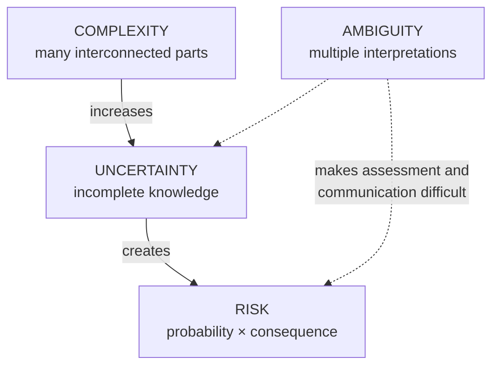

# Problem Complexity, Uncertainty, Risk and Ambiguity

> **Source:** `Module 2/Problem Complexity Uncertainty Risk Ambiguity.pdf` (Lecture 07), pages 1–17 · `Module 2/Lecture Notes Module II EPP.pdf`, pages 16–20 · **Syllabus:** Selected Functions of Engineering

## Key points

- In the real world problems are rarely well-defined: they involve **multiple variables, conflicting objectives, incomplete data and external constraints**.
- The four factors together are abbreviated **CURA** — **C**omplexity, **U**ncertainty, **R**isk, **A**mbiguity.
- They compound: **complexity increases uncertainty → uncertainty creates risk → ambiguity makes assessment and communication difficult.**
- **Risk = Probability × Consequence.** Uncertainty, unlike risk, **may not have known probabilities**.
- Uncertainty has two kinds: **aleatory** (inherent randomness) and **epistemic** (lack of knowledge).
- Managing CURA is what turns an engineer *from a technician into a strategist*.

---

## 1. Why CURA matters

Engineering professionals frequently face challenges that are **not straightforward**. Engineering problems are often complex, uncertain, risky and ambiguous, and engineers must learn to manage these aspects for **effective decision-making**.

Understanding CURA equips engineers with a structured way of thinking:

| Factor | What understanding it gives you |
|---|---|
| **Complexity** | Helps recognize **system interdependencies**. |
| **Uncertainty** | Prepares for **unknowns and variability**. |
| **Risk** | Focuses attention on **consequences and probabilities**. |
| **Ambiguity** | Encourages **clear communication and problem framing**. |

Future-ready engineers must be equipped not only with technical knowledge but also with **systems thinking, decision-making under uncertainty, and effective risk management** capabilities.

### Consequences of ignoring CURA

Ignoring or mismanaging these conditions leads to **project delays, system failures, budget overruns, safety incidents and legal liabilities**. Proactively addressing CURA leads to **innovation, adaptability and resilience** in engineering systems.

## 2. The four concepts

### 2.1 Complexity

**Definition.** Complexity arises when a problem has **many interconnected parts, variables or subsystems**, where changes in one element affect others **unpredictably**.

**Characteristics of complex problems:**
- Multiple interdependent variables
- **Non-linear** cause-and-effect relationships
- Requires **multidisciplinary** knowledge
- May lack a **single "right" solution**

**Types of complexity:**

| Type | Meaning |
|---|---|
| **Structural** | Many parts or stakeholders. |
| **Dynamic** | Conditions evolve with time. |
| **Socio-technical** | Involving human and machine interaction. |

**Examples in engineering:** designing a smart grid system; integrating hardware, software and AI in autonomous vehicles.

**Approaches to handle complexity:**

| Approach | What it does |
|---|---|
| **Systems thinking** | Understanding interconnections between subsystems. |
| **Modeling and simulation** | Using mathematical/AI models to represent systems. |
| **Decomposition** | Breaking complex problems into smaller, manageable parts. |
| **Collaboration** | Engaging experts from different domains. |

### 2.2 Uncertainty

**Definition.** Uncertainty refers to **incomplete knowledge** about a system, process or future outcome.

**Types:**

| Type | Cause | Example |
|---|---|---|
| **Aleatory** (randomness) | Due to **inherent variability** | Material properties, weather |
| **Epistemic** (knowledge-based) | Due to **lack of data, measurement errors, or limited models** | — |

**Sources of uncertainty:**
- **Technical** — incomplete data or measurement errors.
- **Market-based** — customer demand, raw material price fluctuations.
- **Environmental** — climate, policy changes.

**Examples in engineering:** predicting fatigue life of a component under variable loading; forecasting renewable energy generation (solar/wind).

**Strategies to manage uncertainty:**
- Collect **more data** (experiments, testing).
- Use **probabilistic methods** (Monte Carlo simulation).
- Apply **sensitivity analysis** to identify critical factors.
- Adopt **robust design** principles.

> **Uncertainty vs. risk:** unlike risk, **uncertainty may not have known probabilities**.

### 2.3 Risk

**Definition.** Risk is the **possibility of an adverse outcome due to uncertainty** — the probability of an adverse outcome multiplied by its consequence.

$$\text{Risk} = \text{Probability of failure} \times \text{Impact of failure}$$

**Types of risk:**

| Type | Example |
|---|---|
| **Operational** | Machine failures |
| **Safety** | Hazards to human life; risk of failure in a bridge due to material fatigue |
| **Financial** | Cost overruns; financial risk in adopting new technologies |
| **Legal / compliance** | Regulatory violations |

Another example given: **cybersecurity risk in industrial IoT systems**.

**Risk management process (four steps):**

| Step | Question it answers |
|---|---|
| **Risk identification** | What can go wrong? |
| **Risk assessment** | Likelihood and severity? |
| **Risk mitigation** | Preventive and corrective measures? |
| **Risk monitoring** | Continuous tracking and updates. |

### 2.4 Ambiguity

**Definition.** Ambiguity arises when information is **open to multiple interpretations**, or when **goals and priorities are unclear**.

**Sources of ambiguity:**
- Poorly defined problem statements.
- Conflicting stakeholder requirements.
- Lack of common terminology or standards.

**Common in:** the early stages of design when requirements are not finalized; communication with clients or stakeholders who use vague terms such as *"high performance"* or *"low cost."*

**Examples in engineering:** ambiguous customer requirements in product design; policy uncertainty in renewable energy projects.

**Strategies to reduce ambiguity:**
- Improve **communication and documentation**.
- Engage **stakeholders early and frequently**.
- Use **prototyping and iterative design**.
- Develop **decision-support tools**.

## 3. Interrelation of the factors

- **Complexity increases uncertainty.**
- **Uncertainty creates risk.**
- **Ambiguity makes assessment and communication difficult.**
- Engineers must **balance all four** challenges.

## 4. Frameworks and approaches for managing CURA

### 4.1 Systems thinking

- Views a problem **holistically** rather than as isolated parts.
- Encourages understanding of **feedback loops, interactions and emergent behaviour**.
- Useful for: urban infrastructure design; climate-resilient water management systems.

### 4.2 Scenario planning

- Developing **multiple future scenarios** — best-case, worst-case, expected — to prepare for uncertainty.
- Helps teams respond **flexibly** to unexpected developments.
- *Example:* planning infrastructure for various flood risk levels in coastal cities.

### 4.3 Risk management process (ISO 31000)

1. **Identify** risks (hazards, project risks)
2. **Analyze** risks (likelihood and impact)
3. **Evaluate** risks (prioritize)
4. **Treat** risks (eliminate, reduce or accept)
5. **Monitor and review** continuously

> This is the five-step ISO 31000 version of the four-step process in §2.3 — the extra step being the explicit **evaluate/prioritize** stage between analysis and treatment. **ISO 31000** is also listed among the safety standards in [Design for Safety](01-design-for-safety.md#6-regulatory-and-ethical-framework).

### 4.4 Design thinking

- **Human-centered** problem-solving approach.
- Helps **navigate ambiguity** by engaging stakeholders, prototyping and iterating.
- *Example:* designing wearable healthcare devices with elderly users involved in early design stages.

### 4.5 Monte Carlo simulation

- Uses **random sampling and statistical modeling** to understand risk and uncertainty in forecasts.
- *Example:* estimating the **range of possible outcomes** for cost and time in large engineering projects.

### 4.6 Redundancy and safety margins

- In complex or high-risk systems, engineers add **fail-safe mechanisms and buffers**.
- Common in: aerospace (multiple redundant control systems); civil structures (safety factor in load-bearing design).

> The engineering detail behind redundancy and safety factors is in [Design for Safety](01-design-for-safety.md#3-key-considerations-in-design-for-safety) and [Design for Reliability](02-design-for-reliability.md#5-design-techniques-and-strategies).

## 5. Case studies

### Boeing 737 MAX — complexity and ambiguity

- **Problem:** the **MCAS** (Maneuvering Characteristics Augmentation System) software had a critical role in stabilizing flight but **wasn't adequately documented or communicated to pilots**.
- **Complexity:** integration of new software into an **older airframe**.
- **Ambiguity:** miscommunication and incomplete training created **multiple interpretations of system behaviour**.
- **Lesson:** clear documentation and testing in complex systems are vital. Engineers must **anticipate system-wide effects of software updates**.

### Fukushima Nuclear Disaster — risk and uncertainty

- **Problem:** the plant was designed to withstand an **earthquake**, but not the scale of the **tsunami** that followed.
- **Risk underestimated:** engineers had **insufficient data on extreme tsunami probabilities**.
- **Uncertainty:** lack of historical precedent led to under-preparation.
- **Lesson:** risk models must consider **low-probability, high-impact events (Black Swans)**, especially in safety-critical systems.

### Mars Climate Orbiter — ambiguity and systems failure

- **Problem:** a navigation error caused the orbiter to enter Mars's atmosphere at the wrong angle and disintegrate.
- **Ambiguity:** **Lockheed Martin used imperial units; NASA expected metric units.**
- **Result:** **$125 million** loss.
- **Lesson:** clear **standards and communication protocols** are essential in multi-team or multinational projects.

## 6. Worked case studies from the lecture deck

### 6.1 Designing smart manufacturing systems (Industry 4.0)

Smart manufacturing integrates **automation, IoT, AI, robotics and data analytics** to optimize production systems.

| Factor | In this case |
|---|---|
| **Complexity** | Multiple interconnected technologies (sensors, robotics, cloud systems, AI algorithms); data flows across different machines, networks and decision layers; cyber-physical systems need integration across hardware and software. |
| **Uncertainty** | How new technologies will perform at large scale; data quality and reliability from IoT sensors; rapid technology evolution — tools chosen today may be outdated tomorrow. |
| **Risk** | Cybersecurity attacks on automated systems; system downtime due to integration failures; high financial risk from investing in expensive but unproven technologies. |
| **Ambiguity** | Lack of clear industry standards for interoperability; different stakeholders (management, operators, IT teams) may interpret *"smart manufacturing"* differently. |

### 6.2 Urban transportation planning

Designing metro systems, bus rapid transit or smart traffic control involves **engineering, policy and social** dimensions.

| Factor | In this case |
|---|---|
| **Complexity** | Involves roads, rail, traffic signals, pedestrian pathways, vehicles and human behaviour; multiple stakeholders (government, citizens, transport operators, environmental groups); huge infrastructure scale with interconnected subsystems (stations, power, signaling, vehicles). |
| **Uncertainty** | Unpredictable population growth and travel demand; uncertainty in fuel prices or future mobility trends (electric vehicles, shared mobility); data gaps in traffic surveys and travel behaviour. |
| **Risk** | Cost overruns and delays in mega projects; safety risks (accidents, infrastructure failure); political risk if the system fails to meet public expectations. |
| **Ambiguity** | Conflicting goals — some prioritize low-cost solutions, others environmental sustainability; policy directions (metro rail vs. road expansion?) may be unclear. |

### 6.3 Sustainable energy systems integration

Listed by the deck as a third CURA case study alongside the two above.

## 7. Role of the engineer in managing CURA

Engineers are not just technical experts but **decision-makers and leaders** who must:

- **Identify and clarify** stakeholder expectations.
- **Communicate risks and uncertainties transparently.**
- Use **data and modeling tools** to support judgment.
- Build **resilient systems** that can adapt to change.
- **Balance trade-offs** — cost vs. safety, performance vs. reliability.

## 8. Best practices

- **Early risk identification** and continuous monitoring.
- **Cross-functional teams** — diverse perspectives reveal hidden assumptions.
- **Prototyping and testing** under various real-world conditions.
- Use of **standards and compliance frameworks** to reduce ambiguity.
- **Transparent documentation** to minimize misunderstandings.

## 9. Conclusion

Complexity, uncertainty, risk and ambiguity are **not obstacles to engineering — they are its defining challenges**. Mastering these elements transforms an engineer **from a technician into a strategist, problem-solver and innovator**.

By combining analytical tools with communication skills, ethical judgment and systems awareness, engineers can develop robust solutions in an unpredictable world. The ultimate goal is **not just to build systems that work, but systems that withstand, adapt and evolve**.
