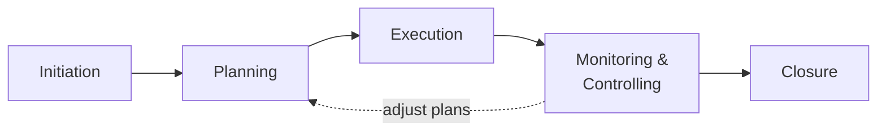
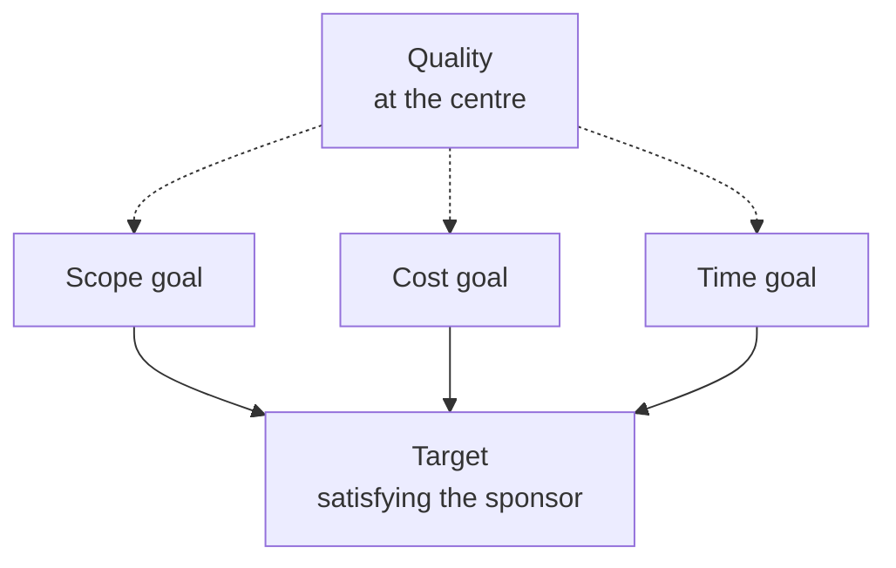

# Project Management

> **Source:** `Module 2/Project Management PDF.pdf` (Lecture 08), pages 1–23 · `Module 2/Lecture Notes Module II EPP.pdf`, pages 21–26 · **Syllabus:** Selected Functions of Engineering

## Key points

- A **project** is a temporary endeavour with a **defined start and end point**, creating a **unique** product, service or result.
- **Project management** = applying knowledge, skills, tools and techniques to project activities to meet project requirements (**PMI**), always **within a defined set of constraints**.
- Management itself is the process of **Planning, Organizing, Controlling and Measuring**.
- Five life-cycle phases: **Initiation → Planning → Execution → Monitoring & Controlling → Closure**.
- The **triple constraint (iron triangle)** is **scope, time, cost** — with **quality at the centre**. Change one and the others move.
- *If you can't plan it, you can't do it. If you can't measure it, you can't manage it.*

---

## 1. Definitions

| Term | Definition |
|---|---|
| **Project** | A group of **milestones or phases, activities or tasks** that support an effort to accomplish something. More fully: a **collection of linked activities**, carried out in an organised manner, with a **clearly defined START POINT and END POINT**, to achieve some specific results desired to satisfy the needs of the organisation at the current time. |
| **Management** | The process of **Planning, Organizing, Controlling and Measuring**. |
| **Project management** | A **dynamic process** that utilises the appropriate resources of the organisation **in a controlled and structured manner**, to achieve some clearly defined objectives identified as needs. It is always conducted **within a defined set of constraints**. |
| **Project management (PMI)** | The application of **knowledge, skills, tools and techniques** to project activities to meet project requirements. |

**A project** (PMI) is a **temporary endeavor undertaken to create a unique product, service, or result**. Every engineering project has a defined start and end date, a unique objective or outcome, and constraints of **cost, time, scope and quality**.

## 2. Characteristics of a project

- **Temporary**, with a defined start and end.
- **Unique deliverables** (software product, system, research prototype, etc.).
- **Progressive elaboration** — detailed planning evolves with project progress.
- Involves **multiple stakeholders**.

## 3. Importance in engineering

- Ensures **timely delivery** of software/hardware projects.
- Balances **scope, cost and time** — the triple constraint.
- Enhances **teamwork, communication and risk control**.

### Who uses project management?

**Nearly everyone, to some degree.** People plan their days, weeks, vacations and budgets and keep a simple project management form known as a **"To Do" list**. Any process or means used to **track tasks or efforts towards accomplishing a goal** could be considered project management.

### Why is it used?

- It is necessary to **track or measure the progress** achieved towards a goal.
- It aids in **maximizing and optimizing resources** to accomplish goals.

### Why is it important?

- Enables us to **map out a course of action** or work plan.
- Helps us think **systematically and thoroughly**.
- Handles a **unique task**, with a **specific objective**, a **variety of resources**, and is **time bound**.

### How much time does it take?

**Not much.** Probably **more time is wasted as a consequence of lacking a project management tool than is spent** to plan adequately, organize, control effectively and measure appropriately. As for how long: **as long as there are things to do.**

## 4. What project management entails

| Function | The deck's note on it |
|---|---|
| **Planning** | Is the **most critical** and gets the **least amount of our time**. *"Beginning with the End in mind"* — Stephen Covey. |
| **Organizing** | In an orderly fashion (contingent / prerequisites). |
| **Controlling** | Is critical if we are to **use our limited resources wisely**. |
| **Measuring** | To determine if we accomplished the goal or met the target. |

**Measuring asks:** Are we efficient? Are we productive? Are we doing a good job? What is the outcome? Is it what we wanted it to be?

> **If you can't plan it, you can't do it. If you can't measure it, you can't manage it.**

> These four are the same managerial functions treated in their own right in [Managerial Functions in Engineering](08-managerial-functions.md), where the deck's *controlling/measuring* pair is replaced by *motivating* and *accounting*.

## 5. The project life cycle

| Phase | Activities |
|---|---|
| **1. Initiation** | Define the project objectives, **feasibility** and value. Identify **stakeholders** and secure approvals. Prepare a **business case and project charter**. |
| **2. Planning** | Develop a project management plan. Break the project into tasks (**WBS — Work Breakdown Structure**). Plan for time, cost, resources, communication, risk and quality. Identify **milestones and deliverables**. Includes **schedule and cost estimation** and risk management. |
| **3. Execution** | Allocate resources and implement tasks. Coordinate team activities and manage communications. Ensure quality standards are met. Use **leadership and motivation** to drive performance. |
| **4. Monitoring & Controlling** | Track progress against the plan. Measure performance using **KPIs** such as **Earned Value**. Adjust schedules and resources to avoid delays. Manage **scope creep** and mitigate emerging risks. |
| **5. Closure** | Final product delivery and client approval. Release resources and conduct post-project evaluation. **Archive documents and lessons learned.** |

## 6. The triple constraint (iron triangle)

> The deck presents this as an image. The content below is **transcribed from that slide image** and the lecture notes.

All projects operate within three constraints, with **quality at the centre** of the triangle:

| Constraint | Description |
|---|---|
| **Scope** | Defined work and deliverables |
| **Time** | Deadlines for deliverables |
| **Cost** | Budgetary limits |

**A change in one affects the others.**

> Successful project management means **meeting all three goals — scope, time and cost — and satisfying the project's sponsor.**

## 7. Roles

| Role | Responsibility |
|---|---|
| **Project Manager (PM)** | Oversees planning, execution, monitoring and closure. |
| **Project Engineer** | Provides technical direction and ensures compliance with specifications. |
| **Stakeholders** | Clients, users, government agencies, community groups, etc. |
| **Functional Managers** | Provide resources and domain expertise. |

## 8. PMBOK knowledge areas

| Area | What it ensures |
|---|---|
| **Integration management** | Coordination of all processes. |
| **Scope management** | Defines boundaries of work. |
| **Time management** | Scheduling — Gantt charts, CPM, PERT. |
| **Cost management** | Budgeting and resource allocation. |
| **Quality management** | Ensures product meets standards (ISO, CMMI). |
| **Human resource management** | Team roles, leadership, motivation. |
| **Communication management** | Stakeholder reporting, progress updates. |
| **Risk management** | Identify, analyze, mitigate risks. |
| **Procurement management** | Handling contracts and external vendors. |

## 9. Methodologies

| Methodology | Application |
|---|---|
| **Waterfall** | Traditional, sequential projects (e.g. civil engineering). |
| **Agile** | Iterative, flexible projects (e.g. software, product design). |
| **Scrum** | Agile framework with **sprints and stand-up meetings**. |
| **Critical Path Method (CPM)** | Scheduling and timeline optimization. |
| **Lean project management** | Minimizing waste and maximizing value. |
| **PERT** (Program Evaluation and Review Technique) | Statistical modeling of project durations **under uncertainty**. |
| **Extreme Programming (XP)** | Listed among the agile and modern approaches. |
| **Kanban** | Listed among the agile and modern approaches. |

## 10. Tools and techniques

### Traditional tools

- **Gantt chart** — a **visual timeline of tasks and dependencies**; helps track progress and identify delays.
- **CPM** (Critical Path Method) and **PERT** (Program Evaluation Review Technique).
- **Work Breakdown Structure (WBS)** — divides a project into manageable parts, making assignment, budgeting and scheduling easier.
- **Risk register** — a catalog of identified risks with **probability, impact and mitigation strategies**.

### Earned Value Management (EVM)

Compares **planned vs. actual** performance:

| Metric | Formula |
|---|---|
| **EV** (Earned Value) | % work completed × Budget |
| **CV** (Cost Variance) | EV − Actual Cost |
| **SV** (Schedule Variance) | EV − Planned Value |

### Software

**MS Project, Primavera, Jira, Trello** aid planning, coordination and tracking.

### Software-engineering-specific

- **Version control (Git)**
- **CI/CD pipelines**
- **Automated testing**

## 11. Advantages of using project management

- In-built **monitoring / sequencing**
- Easy and **early identification of bottlenecks**
- **Activity-based costing**
- Identification and addition of **missing and new activities**
- **Pre-empting unnecessary** activity/expenditure
- **Timely completion**
- Assigning tasks
- Reporting

### Consequences of *not* using a project management tool

**Delay · Cost · Waste of resources · Quality · Dissatisfaction · Reputation**

## 12. Road to better project management

**Setting up:**
1. Find a project plan that **fits your style** of project management needs — it may be as simple as creating **templates, forms and spreadsheets** to track tasks.
2. Form a **Project Management Committee (PMC)**.
3. **List out all the tasks and sub-tasks** to accomplish a goal.
4. Jot down the **time period and person responsible** against each task/sub-task.
5. Identify a **Project Manager**.
6. Identify **Task Managers**.
7. **Sequence the activities** in relation to time period.
8. **Present to the PMC.**
9. **Finalize by reaching an agreement** and start work.

**Implementation:**
- **Regular monitoring**
- **Resource support**
- **Critical issues** discussed and solved
- **Meeting with the team** on completion of each major milestone
- **Track the progress** against the plan
- A **system to add/delete tasks** in the PMT

> **Work smart, not hard!**

## 13. Engineering applications

| Discipline | Application |
|---|---|
| **Civil engineering** | Managing multi-year construction projects (highways, buildings); coordinating contractors, suppliers and compliance agencies. |
| **Mechanical engineering** | Product development lifecycle from concept to testing; tool design, prototyping, manufacturing scale-up. |
| **Software & systems engineering** | Modular development, integration and system testing; requirement management and iterative feedback loops. |

## 14. Case studies

### Delhi Metro Rail Project

- **Challenge:** constructing a safe, timely and cost-effective urban metro system in a **densely populated city**.
- **Success factors:** strong project leadership (**E. Sreedharan**); clear scope and deliverables; advanced planning tools (**Primavera**); stakeholder involvement from early stages.
- **Outcome:** completed **ahead of schedule and under budget**, setting a global benchmark.

### Airbus A380 Development

- **Challenge:** the largest passenger aircraft ever built, with **multinational design and assembly teams**.
- **Complexity:** over **4 million components** and **1,500 suppliers**.
- **Lesson:** initial project delays due to **misaligned software versions** and poor cross-team coordination.
- **Mitigation:** emphasis on **digital mock-up tools** and standardized communication protocols.

### IT Infrastructure Rollout at TCS

- **Context:** deployment of IT solutions across global clients.
- **Approach:** **Agile** project management with **Scrum** teams.
- **Tools:** Jira, Confluence, real-time dashboards.
- **Impact:** faster response to client changes, lower risk of **scope creep**.

## 15. Common challenges

- **Scope creep** due to changing client requirements
- **Budget overruns** from underestimating costs
- **Delays** from poor communication or risk planning
- **Resource conflicts** in matrix organizations
- **Stakeholder misalignment** and unrealistic expectations

## 16. Best practices

1. Define **clear and measurable objectives** at the beginning.
2. **Engage stakeholders** early and often for alignment.
3. Use **phased or milestone-based planning** for better control.
4. Implement **risk management from day one**.
5. **Communicate transparently and frequently.**
6. Adopt **change management protocols** to handle evolving demands.
7. **Document everything** — from assumptions to outcomes.

## 17. Certifications and frameworks

- **PMP** (Project Management Professional) — PMI
- **PRINCE2** — UK Government standard
- **Agile Certified Practitioner (PMI-ACP)**
- **ISO 21500** — international standard for project management
- **Construction Management Certification (CMAA)**

## 18. Conclusion

Project management is **both a science and an art**. It requires engineers to balance **technical execution with leadership, communication and strategic thinking**. In a world of tightening deadlines, shrinking budgets and increasing complexity, the ability to manage projects efficiently is a **critical skill**.

For engineers, mastering project management means **transforming ideas into reality** — delivering quality solutions safely, sustainably and successfully.
