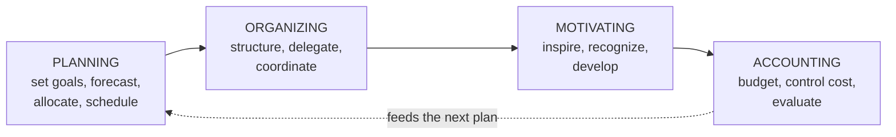

# Managerial Functions in Engineering

> **Source:** `Module 2/Lecture Notes Module II EPP.pdf`, pages 27–31 · **Syllabus:** Selected Functions of Engineering

## Key points

- Technical expertise alone is not sufficient for success — engineers frequently hold **leadership roles** or work in interdisciplinary teams where **managerial functions** decide the outcome.
- Four core functions: **Planning, Organizing, Motivating, Accounting**. They are **not isolated** but form a **cycle**.
- **Planning** is the foundation of all managerial activity; **organizing** arranges resources to execute the plan; **motivating** drives commitment; **accounting** measures and controls cost.
- Three motivational theories are applied: **Maslow's hierarchy**, **Herzberg's two-factor theory**, and **McGregor's Theory X and Theory Y**.

---

## 1. The cycle

## 2. Planning

Planning is the **foundation of all managerial activities**. In engineering it involves **setting goals, determining the necessary actions** to achieve them, and outlining how to **coordinate personnel and resources** efficiently.

### Types of planning

| Type | Horizon and content | Example |
|---|---|---|
| **Strategic** | Long-term goals, typically involving capital investment and product innovation. | Planning to develop a new power plant or smart infrastructure system. |
| **Tactical** | Bridges strategic and operational goals. | Planning the phases of a construction project or the rollout of a new mechanical product. |
| **Operational** | Day-to-day activities. | Scheduling equipment maintenance or organizing production shifts. |

### Key activities

| Activity | What it means |
|---|---|
| **Goal setting** | Define clear, measurable objectives. |
| **Forecasting** | Use historical data and models to predict future demand, costs or technical performance. |
| **Resource allocation** | Determine materials, manpower and financial resources needed. |
| **Risk planning** | Identify possible technical, financial or logistical risks and develop mitigation strategies. |
| **Scheduling** | Create Gantt charts, timelines and milestone plans. |

**Tools used:** Microsoft Project, Primavera P6, **SWOT analysis**, **PERT/CPM**, and **Monte Carlo simulation**.

> Scheduling tools and risk planning are developed further in [Project Management](07-project-management.md#10-tools-and-techniques) and [Problem Complexity, Uncertainty, Risk and Ambiguity](06-problem-complexity-uncertainty-risk-and-ambiguity.md#4-frameworks-and-approaches-for-managing-cura).

## 3. Organizing

Once planning is done, **organizing** is the process of arranging resources — **human, financial, informational and physical** — in the most effective way to execute the plan.

### Key components

| Component | What it involves |
|---|---|
| **Organizational structure** | Hierarchical, matrix or flat structures based on project needs. |
| **Delegation of authority** | Assigning tasks with appropriate decision-making powers. |
| **Coordination** | Synchronizing efforts across departments — design, manufacturing, quality control, procurement. |
| **Workforce structuring** | Creating teams based on project requirements (R&D teams, installation crews, testing units). |

### Engineering-specific examples

- In a **civil engineering project**, organizing involves allocating site engineers, contractors, materials and machinery to different phases of construction.
- In a **manufacturing plant**, it includes organizing shifts, machines, safety protocols and material logistics to ensure uninterrupted production.

**Tools used:** organization charts, **RACI matrices** (Responsible, Accountable, Consulted, Informed), **ERP systems** such as SAP or Oracle.

## 4. Motivating

**Motivating** means stimulating individuals or teams to work effectively and with commitment toward organizational goals. Engineers in leadership roles must understand both **intrinsic and extrinsic** motivators.

### Motivational theories applied in engineering

| Theory | Application |
|---|---|
| **Maslow's Hierarchy of Needs** | Satisfying engineers' needs from **basic safety to self-actualization** through recognition and career development. |
| **Herzberg's Two-Factor Theory** | Ensuring **hygiene factors** such as salary and working conditions are in place, while also providing **growth opportunities**. |
| **McGregor's Theory X and Theory Y** | Encouraging managers to view engineers as **self-motivated (Theory Y)** and design jobs that provide **autonomy and responsibility**. |

### Motivation techniques in engineering teams

- Offering **challenging projects** and opportunities for innovation.
- **Recognizing achievements** in design, safety or productivity improvements.
- **Performance bonuses** linked to efficiency or cost-saving.
- **Continuous skill development** and training in new technologies.

### Leadership and motivation

- Engineering managers must use **transformational leadership** styles to inspire and align team members with project visions.
- **Team-building exercises, open-door policies and transparent communication channels** help build trust and motivation.

## 5. Accounting

Accounting in engineering goes **beyond financial bookkeeping**. It plays a crucial role in **cost management, budgeting, investment analysis and performance evaluation**.

### Key accounting functions in engineering projects

| Function | What it involves |
|---|---|
| **Budget preparation** | Estimating the total cost of a project including materials, labour, equipment and contingencies. |
| **Cost control** | Monitoring actual expenditures vs. the budget using **variance analysis**. |
| **Capital investment analysis** | Using financial tools to evaluate whether to invest in a new machine or technology. |
| **Asset management** | Tracking and maintaining engineering assets such as equipment and facilities. |

### Important financial tools

| Tool | Purpose |
|---|---|
| **Break-even analysis** | Determines when a project or product becomes profitable. |
| **NPV (Net Present Value)** and **IRR (Internal Rate of Return)** | Assess long-term investments in engineering equipment. |
| **Depreciation methods** | Help estimate the value of assets over time. |
| **Activity-Based Costing (ABC)** | Assigns overhead costs based on **actual activity usage**. |

**Example.** A mechanical engineering company evaluating whether to purchase a new **CNC machine** would:

1. Estimate the **cost and savings**.
2. Calculate **depreciation and maintenance**.
3. Use **NPV/IRR** to determine if the purchase aligns with financial goals.

> **Break-even analysis** is worked out quantitatively — with formulas, graphs and numerical examples — in [Costing and Accounting](09-costing-and-accounting.md).

## 6. Integrating the functions

While each function has its distinct role, successful engineering managers must **integrate them**. For example, a new product development team will:

| Function | What the team does |
|---|---|
| **Planning** | Plan timelines and resources |
| **Organizing** | Allocate design, prototyping and testing tasks |
| **Motivating** | Encourage innovation and team cohesion |
| **Accounting** | Monitor project costs and profitability |

## 7. Case studies

### Planning and organizing — Bengaluru Metro Rail Project

- **Challenge:** expanding urban metro services in a congested city.
- **Approach:**
  - Strategic planning of routes and commuter loads.
  - Organizing teams for civil work, signal systems and station development.
  - Motivating teams through **milestone-based incentives**.
  - **Cost tracking and regular audits** for budget control.

### Motivation and cost control — Toyota Manufacturing

- **Problem:** reducing defects while maintaining employee satisfaction.
- **Solution:**
  - Implemented **Kaizen** (continuous improvement) to motivate workers.
  - Used **lean accounting** to reduce waste and control production costs.

> Toyota's wider production system is covered in [Quality and Productivity Tools](05-quality-and-productivity-tools.md#3-case-study--toyota-production-system-tps).

### Integrated managerial functions — ISRO

- **Scenario:** managing satellite and launch vehicle programs.
- **Functions integrated:**
  - **Planning** launch schedules and payload configurations.
  - **Organizing** design and assembly teams across multiple locations.
  - **Motivating** scientists and engineers through recognition and autonomy.
  - **Monitoring expenditure** and maximizing ROI on government funding.

## 8. Conclusion

The successful execution of projects and innovations depends not just on technical skill, but on **effective management**. An engineer who understands these functions is better equipped to:

- **Lead** multidisciplinary teams.
- **Optimize** resource usage.
- **Achieve goals within constraints.**
- Create a **motivating and productive** work environment.

Therefore, developing **managerial competence is as critical as honing engineering knowledge** for every professional in the field.
